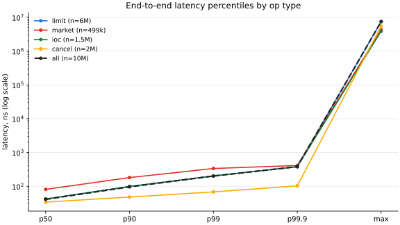
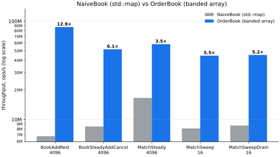

# LOB — a low-latency limit order book & matching engine

[](https://github.com/Ashrith-k/low-latency-orderbook/actions/workflows/ci.yml)

A single-threaded-hot-path, zero-allocation limit order book and matching engine
in C++20. Price-time priority matching behind lock-free SPSC ingress/egress
rings, a cache-friendly banded price ladder over an arena-allocated order pool
(no heap allocation after startup), an async binary logger that never blocks the
engine, and a benchmark suite that reports its environment along with its
numbers. Correctness rests on differential testing: millions of seeded random
commands driven through both the optimized book and a naive `std::map`
reference, with byte-exact event-stream comparison, under ASan/UBSan/TSan-clean
CI.



**Headline numbers** (release build, details and caveats [below](#benchmark-results)):
**7.5M commands/s** through the full four-thread pipeline at **p50 41 ns /
p99 201 ns / p99.9 380 ns** per command, and **5–14× faster** than the
`std::map` reference book across every measured scenario.

## Why this exists

Order books are the classic latency-engineering exercise: a tiny amount of
logic (add, cancel, match) executed so often that data layout, allocation, and
synchronization decisions dominate everything else. This project builds one the
way real exchanges do — single writer, no locks, no allocation on the hot
path — and then does the part that's usually skipped: **proves the fast version
is exactly as correct as the obvious version**, and measures every optimization
honestly, including the ones that failed.

Design goals (from [DESIGN.md](DESIGN.md)):

- **Correctness first** — differential testing against a naive reference book
  is the centerpiece, not an afterthought.
- **Latency** — sub-microsecond p99 per operation on a modern x86 core.
- **Throughput** — ≥ 1M operations/s on a single engine thread (measured: 7.5M
  through the full pipeline, 40–100M on the book alone).
- **Zero heap allocation on the hot path** — enforced by a test that replaces
  global `operator new` and counts.
- **Sanitizer-clean** — ASan, UBSan, TSan all green in CI.
- **Reproducible benchmarks** — deterministic replay files, pinned threads,
  warmup discard, documented environment.

## Architecture

```
┌────────────────────┐   commands    ┌──────────────────────────┐   events    ┌────────────────┐
│ Producer thread    │  SPSC ring    │ Engine thread (pinned)    │  SPSC ring  │ Logger thread  │
│ workload generator ├──────────────▶│  MatchingEngine           ├────────────▶│ AsyncLogger    │
│ or replay reader   │               │   └─ OrderBook            │             │ binary log +   │
└────────────────────┘               │   └─ OrderPool (arena)    │             │ stats          │
                                     │   └─ LatencyRecorder      │             └────────────────┘
```

**Single-writer principle**: the engine thread exclusively owns all book state.
There are no locks anywhere on the hot path; the only synchronization in the
system is the two SPSC rings, each a release/acquire pair with cache-line-padded
producer and consumer blocks. The engine batch-pops up to 256 commands at a
time, processes them FIFO, and pushes fixed-size 32-byte events out the other
side.

The public API is direct calls or the ring loop — both paths are counted and
tested identically:

```cpp
lob::MatchingEngine engine({.anchor_price = 1'000, .band_radius = 4096, .pool_capacity = 1 << 20});
auto sink = [](const lob::Event& e) { /* fills, accepts, rejects */ };
lob::OrderId id = engine.submit(lob::Side::kBuy, lob::OrderType::kLimit, 999, 10, sink);
engine.cancel(id, sink);
// or: engine.run(command_ring, stop_flag, ring_push_sink);
```

Events go to a templated per-call sink rather than a stored `std::function` —
no allocation, no indirect call, fully inlinable.

## Key design decisions

Each one: the problem, the options, the choice, and what it measured.

### 1. A banded array of price levels, not a `std::map`

**Problem.** The book's inner loop is "find the best level, walk it, step to
the next" — a red-black tree pays a cache miss per hop exactly where the hot
path lives. **Options:** `std::map<price, level>` (simple, ordered, slow),
hash map + heap (fast lookup, slow best-price), or a contiguous array of levels
indexed by tick offset within a band around an anchor price. **Choice:** the
banded array (default ±4096 ticks) with a best-price cursor, falling back to a
`std::map` overflow region for rare out-of-band prices — and the `std::map`
book is kept alive as both the correctness oracle and the benchmark baseline.
**Measured:** 10.5–14.5× on add/rest, 5.2–6.0× on steady add/cancel churn,
3.5–6.3× on matching, the gap *widening* with sweep breadth (the map pays an
erase + rebalance per exhausted level; the array pays a cursor step).

The honest part: the array had a worst case the map didn't. Draining a side
*truly* empty forced an O(band_radius) cursor rescan — ~0.9 µs, **23× slower
than the map** in that regime. A per-side order counter makes the empty-side
transition O(1); that one fix took the drain benchmark from 0.94M to 88.5M
cmd/s. The full story, including the optimization that measured *negative* and
was reverted, is in [docs/optlog.md](docs/optlog.md).

### 2. Pool indices instead of pointers; order ids that encode their own slot

**Problem.** Orders need FIFO links, level membership, and O(1) cancel by id —
pointer-linked nodes cost 8 bytes per link and a hash map for id lookup.
**Choice:** one 64-byte cache-line `Order` POD in a pre-sized arena
(`OrderPool`), intrusive links as 32-bit pool indices, and
`order_id = generation << 32 | index` so cancel lookup is a bounds check plus
one 64-bit compare — no hash map anywhere on the hot path, and the generation
bits catch stale ids (ABA) deterministically. **Measured:** cancel is the
cheapest operation in the end-to-end table — p50 34 ns, p99 68 ns.

### 3. One writer, two lock-free rings

**Problem.** Getting commands in and events out without ever stalling the
matching thread. **Choice:** single-producer/single-consumer rings with
monotonic uint64 head/tail, cached peer indices, and `alignas(64)` on both
blocks so steady-state operation never writes a cache line the other thread
polls. Memory-ordering rationale is a one-line comment at every atomic.
**Measured:** the padded ring moves 101.7M items/s vs 68.0M unpadded (+51%) on
this host — an understatement of the cross-core effect, since the two vCPUs
here are SMT siblings sharing L1/L2.

### 4. Fixed-point integer prices and memcmp-able events

**Problem.** Floating-point prices make matching semantics environment-
dependent and event comparison fuzzy. **Choice:** `int64` ticks everywhere; no
floating point in the engine at all (even latency percentiles are integer
math). `Command`, `Event`, and the 32-byte log record are PODs with explicit
padding and `static_assert`ed unique object representations — so the
differential harness compares emitted event streams **byte for byte** with
`memcmp`, and replay files are byte-identical across toolchains.

### 5. Logging that sheds load instead of blocking

**Problem.** Observability that can't perturb the thing it observes.
**Choice:** the hot path writes a 32-byte binary record into an SPSC ring; a
logger thread formats and flushes. Backpressure policy is **count-and-drop** —
the engine never blocks, and the drop counter is itself a published metric, so
"dropped" is always a measured fact rather than a silent lie.

## Benchmark results

**Environment — read this first.** All numbers: AMD EPYC 7763 GitHub Codespace
VM, **2 vCPUs that are SMT siblings of one physical core**, unpinned, gcc
13.3 `-O3`, Google Benchmark v1.9.1, mean of 3 repetitions. Run-to-run
variance ±5–10%; the VM hides the PMU, so there are no cache/branch/IPC
counters. **These are indicative numbers; a bare-metal rerun owns the final
table.** Full methodology and scaling tables: [docs/results.md](docs/results.md).

### Book vs reference (identical pregenerated scripts)



| scenario (what it measures) | naive | book | speedup |
|---|---|---|---|
| BookAddRest/4096 — fill an empty book with 4096 passive limits | 7.1M ops/s | 102.6M ops/s | **14.5×** |
| BookSteadyAddCancel/4096 — 64Ki-op 50/50 add/cancel churn at constant depth | 8.7M ops/s | 52.2M ops/s | **6.0×** |
| MatchSteady/4096 — maker/taker pairs at the touch over a 4096-order book | 16.4M cmd/s | 62.3M cmd/s | **3.8×** |
| MatchSweep/16 — one IOC sweeping 16 price levels per round | 8.5M cmd/s | 45.0M cmd/s | **5.3×** |
| MatchSweepDrain/16 — same, draining the side truly empty every round | 8.5M cmd/s | 44.8M cmd/s | **5.3×** |

### End-to-end pipeline

Replay file → producer thread → command ring → pinned engine thread → log ring
→ logger thread. 11M-command workload (60% limit / 5% market / 15% IOC / 20%
cancel, Zipf-clustered prices, seed 42), 1M warmup discarded, 10M measured,
per-command rdtsc timing on the engine thread:

**Throughput: 7.5M commands/s** through the full four-thread pipeline.

| op | count | p50 | p90 | p99 | p99.9 | max |
|---|---|---|---|---|---|---|
| limit | 6.00M | 42 ns | 98 ns | 202 ns | 379 ns | 7.5 ms |
| market | 0.50M | 81 ns | 181 ns | 336 ns | 412 ns | 4.3 ms |
| ioc | 1.50M | 42 ns | 99 ns | 202 ns | 380 ns | 3.9 ms |
| cancel | 2.00M | 34 ns | 48 ns | 68 ns | 103 ns | 5.5 ms |
| **all** | 10.0M | 41 ns | 96 ns | 201 ns | 380 ns | 7.5 ms |

**Honest reading of the tail:** the millisecond maxima are scheduler
preemption — four pipeline threads share two SMT-sibling vCPUs, and the run
shows ~61K context switches/s (vs ~300/s for the single-threaded
microbenches). Tail latency is never averaged away here; on isolated cores
that max collapses, but that claim belongs to a bare-metal rerun, not this
table.

### Reproduce

```sh
cmake --preset release && cmake --build --preset release

# Microbenchmarks (JSON feeds tools/plot_bench.py compare):
./build/release/bench/lob_bench --benchmark_repetitions=3 \
    --benchmark_report_aggregates_only=true \
    --benchmark_out=bench.json --benchmark_out_format=json

# End-to-end (CSV feeds tools/plot_bench.py latency):
./build/release/tools/lob_replay generate --out e2e.lobr --ops 11000000 --seed 42
./build/release/bench/lob_e2e_bench e2e.lobr --warmup 1000000

# Hardware counters (bare metal; degrades honestly in VMs):
./scripts/perf_stat.sh --check
```

## Correctness

The interesting risk in a hand-optimized book is silent divergence from the
intended semantics. The defense in depth:

1. **An executable spec.** `NaiveBook` (`std::map` + `std::list`) implements
   price-time priority the obvious way; ~30 unit tests pin its exact event
   streams. It is slow and allocates freely — by design, it is the oracle, and
   it never appears on a hot path.
2. **Differential testing** (the centerpiece). Seeded random command streams —
   including invalid orders, stale-id and forged-id cancels, band-edge and
   out-of-band prices — drive `OrderBook` and `NaiveBook` in lockstep, with
   byte-exact event-stream comparison and state checks after every command.
   CI runs 4 seeds × 25k ops plus two **1M-op** convergence runs; a failing
   seed is printed and replayable via `LOB_DIFF_SEED` / `LOB_DIFF_MATCH_SEED`.
   Divergences found across both 1M-op first runs: zero.
3. **Invariant checks.** Debug builds assert cheap per-op invariants inline
   (uncrossed book, fill progress) and run a full O(book) walk — FIFO link
   symmetry, level aggregates, cursor correctness, census vs pool — at sweep
   cadence in the harnesses.
4. **Concurrency under TSan.** 34 threaded tests across four binaries: queue
   and logger stress, full-pipeline runs with deliberately tiny rings so both
   backpressure edges see real contention, byte-exact event streams vs a
   single-threaded scout engine.
5. **Zero-allocation proof.** A counting replacement of all eight global
   `operator new` forms shows **zero** allocations across a 100k-op
   steady-state window (the documented exception: an out-of-band price
   resting in the overflow map — pinned by its own test as the boundary of
   the guarantee).

290 tests total. CI: {gcc-13, clang-17} × {debug, release}, ASan+UBSan, TSan,
and a format gate.

## Build & run

Requirements: CMake ≥ 3.22, Ninja, gcc-13 or clang-17. GoogleTest and Google
Benchmark come in via `FetchContent` — no system dependencies.

```sh
cmake --preset debug && cmake --build --preset debug
ctest --preset debug --output-on-failure

# Other presets: asan, tsan, release
cmake --preset release && cmake --build --preset release

# Generate a workload and replay it through the engine:
./build/release/tools/lob_replay generate --out demo.lobr --ops 1000000 --seed 7
./build/release/tools/lob_replay run demo.lobr
```

Formatting is Google style via `./scripts/format.sh` (`--check` in CI).
Note for TSan on some kernels (including GitHub runners): clang-17's TSan needs
`sudo sysctl vm.mmap_rnd_bits=28` first, or instrumented binaries crash at
startup; CI's tsan job runs the same sysctl.

## Limitations

- **Every number above is a cloud-VM number.** 2 SMT-sibling vCPUs, no PMU
  access, unpinnable scheduler noise in the tails. The harnesses are built for
  a bare-metal rerun (pinning, warmup discard, `perf_stat.sh`, `-march=native`
  preset) — the table gets replaced, not reinterpreted, when that happens.
- Single symbol, single engine thread — sharding is roadmap, not v1.
- No network gateway; ingress is replay files and in-process generators.
- No order replace (cancel + new covers it) and no persistence/snapshots.
- Out-of-band prices (beyond ±band_radius ticks from the anchor) take a
  `std::map` fallback that allocates — the one documented exception to
  zero-allocation, tested as such.

## Roadmap

epoll TCP gateway with a simple binary protocol → multi-symbol sharding
(symbol hash → engine threads) → book snapshot/recovery → ITCH 5.0 replay
support.

## License

[MIT](LICENSE)
